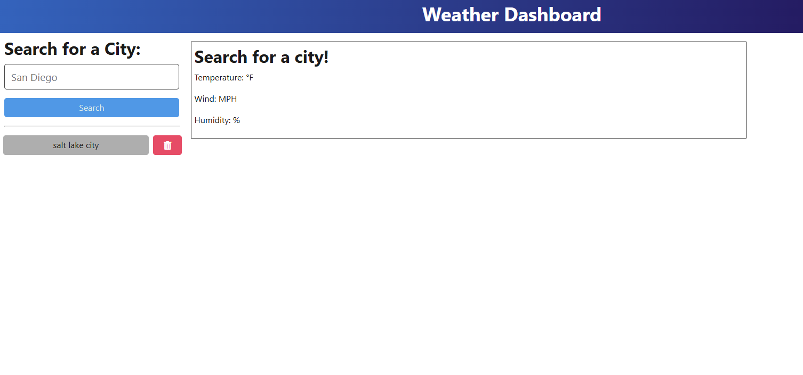
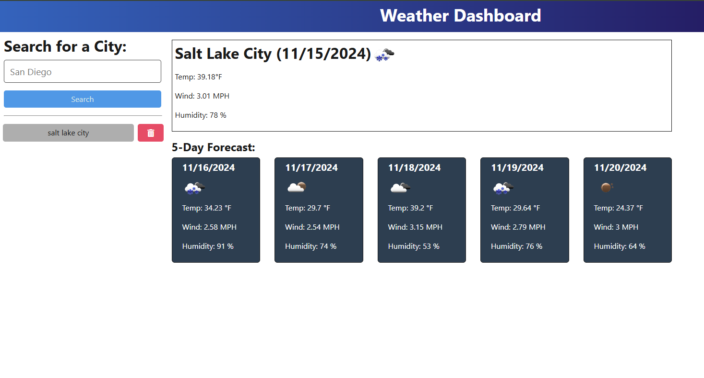
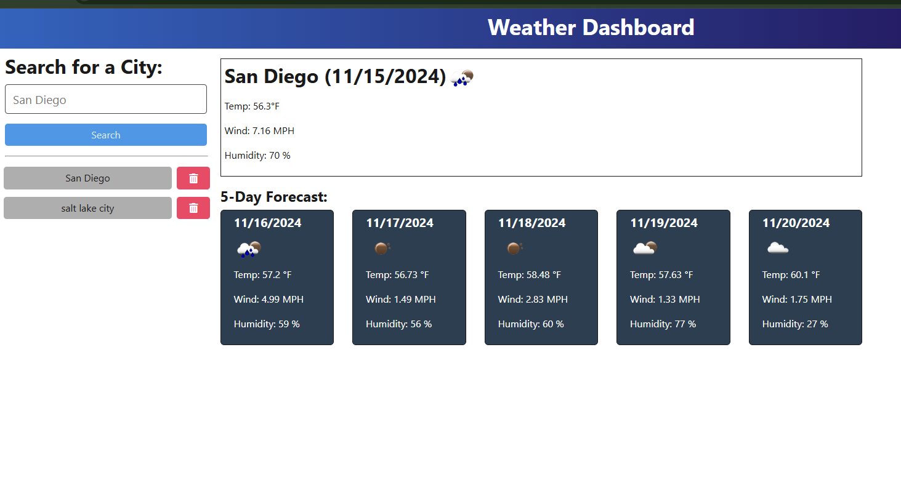

# Weather-Dashboard

 

A weather dashboard app that allows you to search for, and view weather for multiple cities and states. 

This project was designed to help test my skills and abilities utilizing external APIs. For this project I used openWeather API to request and render the data in the browser. 
I was responsible for creating the backend, connecting it to the front end, and deploying the site. 

## Table of Contents 

- [Installation](#installation)
- [Usage](#usage)
- [Features](#features)
- [Screenshots](#screenshots)
- [License](#license)
- [Credits](#credits)
- [ContactMe](#contactme)

## Installation

No installtion required, just follow this link: https://weather-dashboard-rwv9.onrender.com

## Usage

To use this website, first click the link listed above. 
This website is used to check the weather in your area, and other cities. 
You can search for a city in the top left corner of the page, and once you hit search, the weather should appear. 

## Features

* Displays current weather information
* Has a 5 day weather forecast
* Input field to search for weather by city name
* Displays a list of previously searched cities. 

## Screenshots

When you initially land on the page: 

When you search for a city: 

Searching for another city, and saving the previous search: 

## License 

Licensed under MIT

## Credits

Credit to Edx Fullstack Bootcamp instructors and TAs for providing starter code. 

## Contact Me

| Name           | Email                     | GitHub Link                                 | LinkedIn Link                                           |
|----------------|---------------------------|---------------------------------------------|---------------------------------------------------------|
| Mekenna Baker  | mekenna.drabner@gmail.com | [GitHub](https://github.com/Mekenna-Baker) | [LinkedIn](https://www.linkedin.com/in/mekenna--baker/)  |

